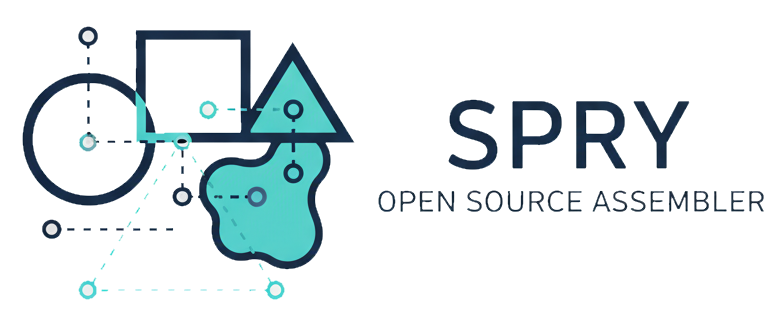

<p align="center">
  
</p>

Spry Assembler is a lightweight system for organizing, transforming, and
assembling SQL-accepting files (and other framework-light sources) into
consistent, reproducible outputs.

Think of Spry as the assembler on your project team:

- It discovers the files you already have (SQL, Markdown, HTML, scripts, AI
  prompts, etc.).
- It applies instructions you add inside those files (annotations and
  directives).
- It runs helpers (called foundries) that generate extra content when needed.
- It assembles everything into consistent outputs that tools can use — for
  example, a SQLite table for SQL-accepting tools like SQLPage, or a set of
  auto-generated files you can share.

Spry is designed for situations where you don’t already have a full-blown
framework. Languages like Java, JavaScript, and TypeScript have large ecosystems
with many frameworks (Spring, React, Next.js, etc.). But SQL, Bash, and even
“non-traditional” sources like AI prompts or Markdown don’t have much structure.
Spry Assembler fills that gap.

## What Spry Assembler Does

- Keeps things organized — pages, prompts, or scripts can be cataloged with
  routes and metadata.
- Removes repetition — you can reuse layouts, headers, or snippets with a single
  directive.
- Runs your helpers — any script or program (Python, Bash, Rust, Node.js, etc.)
  can act as a _foundry_ that generates SQL, JSON, or Markdown.
- Keeps outputs in sync — your source files plus Spry’s rules always produce the
  same results.
- Supports dev workflow — watch files for changes, rebuild automatically, and
  keep SQL-accepting tools up-to-date.

## Key Concepts

Spry Assembler works around four ideas:

1. Annotations (`@...`) — describe intent.

   - Example: give a file a route, title, or role.
   - They _don’t_ change your file, just add meaning.

   ```sql
   -- @route.path /reports
   -- @route.title Monthly Reports
   ```

2. Directives (`#...` or `!...`) — transform content inline.

   - Insert layouts, snippets, or boilerplate into your files.

   ```sql
   -- #include layout default
   SELECT 'content here';
   ```

3. Foundries — helper programs.

   - Write a Python script, Bash file, or TypeScript module that prints SQL,
     JSON, or Markdown.
   - Mark it with an annotation and Spry will run it at the right time.

   ```python
   #!/usr/bin/env python
   # @spry.nature foundry after-sql-files

   print("SELECT 'Hello from AI prompt' AS msg;")
   ```

   Foundries can even generate outputs from AI prompts or other automated
   sources.

4. Stores — where results go.

   - Filesystem: `spry.d/auto/*` (auto-generated files you can inspect or
     commit).
   - Database: an optional SQLite table that SQL-accepting tools (like SQLPage)
     can read directly.

## Why It Matters

- For SQL & Bash: finally have a framework-like system for consistency.
- For AI Prompts: treat them like source code, keep them versioned,
  reproducible, and usable in pipelines.
- For Business Analysts: simple tags (`@route`, `#include`) let you describe
  what you want without writing new frameworks.
- For Teams: deterministic outputs mean the same build runs identically across
  machines.

## Example Use Cases

- A data analyst wants to keep a catalog of SQL queries and reports with
  consistent navigation.
- A business team wants AI prompts to be managed like source code, so outputs
  are predictable.
- A junior developer wants to reuse headers, layouts, or snippets across
  multiple SQL or Markdown files.
- A mixed team needs Python scripts and SQL queries to run in the same
  repeatable workflow.

👉 In short: Spry Assembler is a lightweight system that discovers your files,
applies your rules, runs your helpers, and assembles everything into consistent,
framework-like outputs — even when working with languages or sources that don’t
have frameworks of their own.

## Contributors and Maintainers (TODO: need to refine and elaborate)

### Init after clone

This repo uses git hooks for maintenance, after cloning the repo in your sandbox
please do the following:

```bash
deno task init
```

### Check for missing deps

```bash
deno task doctor
```

You should see something like this:

```bash
Git dependencies
  🆗 .githooks/pre-commit
  🆗 .githooks/pre-push
  🆗 .githooks/prepare-commit-msg
Runtime dependencies
  🆗 deno 1.34.0 (release, x86_64-unknown-linux-gnu)
Build dependencies
  🆗 dot - graphviz version 2.43.0 (0)
  🆗 java 17 2021-09-14 LTS
  🆗 PlantUML version 1.2022.6 (Tue Jun 21 13:34:49 EDT 2022)
```

Doctor task legend:

- 🚫 is used to indicate a warning or error and should be corrected
- 💡 is used to indicate an (optional) _suggestion_
- 🆗 is used to indicate success

If you get any error messages for `dot`, `Java`, or `PlantUML` then you will not
get auto-generated entity relationship diagrams (ERDs).

### Tagging and pushing commits

When you're ready to push code:

```bash
deno task git-hook-pre-commit   # run all tests/validation that will be run by Git commit hook so there are no surprises
git commit -m ...               # commit your if the above shows no errors
deno task prepare-publish       # bump the version tag and prepare for push
git push                        # push the code with the bumped version
```
